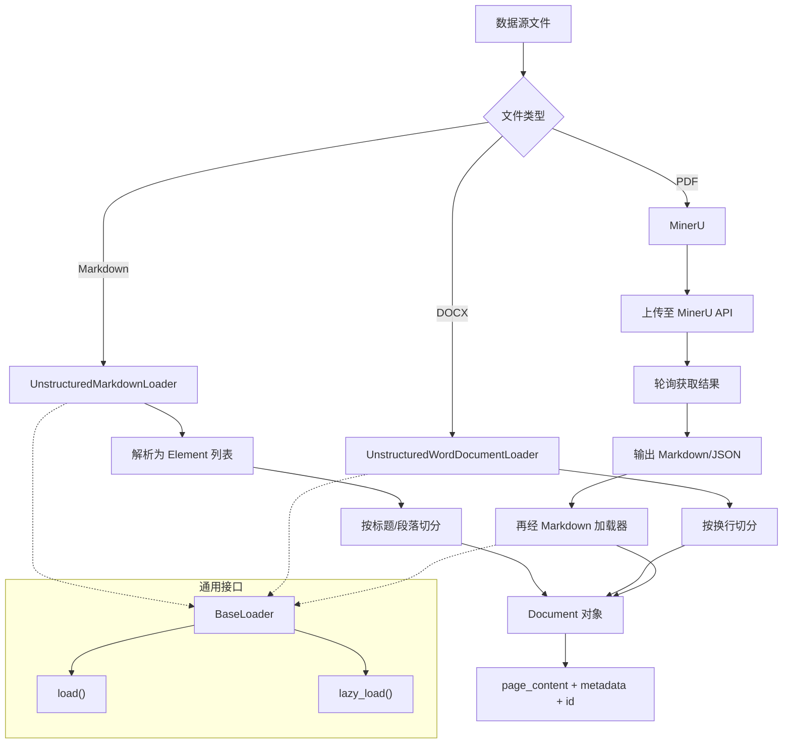
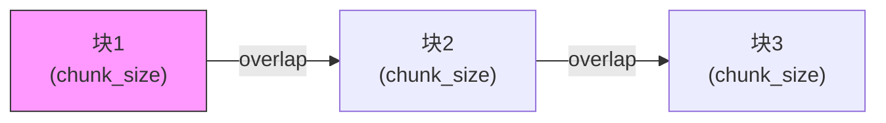
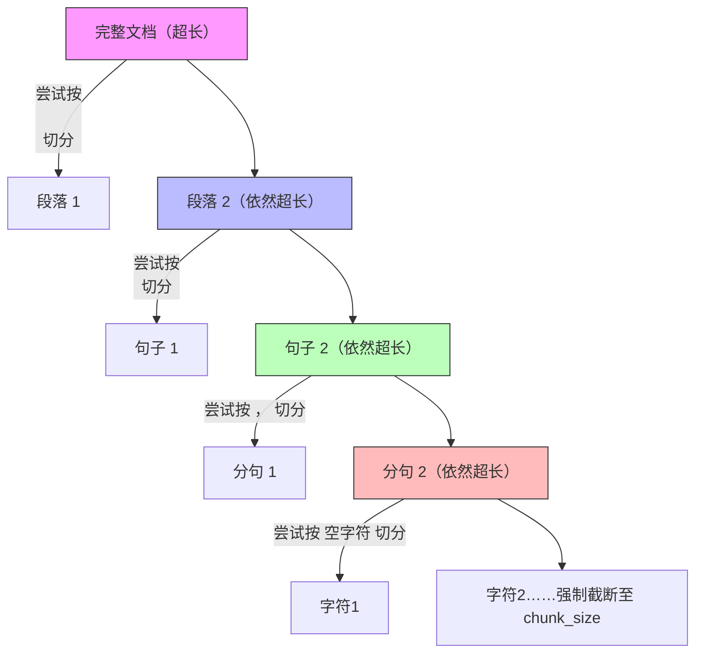

# 第4章RAG 检索

> 内容整理，涵盖 RAG 核心概念、文档加载、切分、嵌入、向量存储与检索及生成落地。

------

## 1. RAG 概述

### 1.1 大模型的局限

- **知识滞后**：训练成本高、周期长，更新不及时。
- **知识缺失**：专有领域细节不足(无法通过公开训练数据掌握所有专业细节)，回答不准确。
- **幻觉**：编造事实、推理错误、理解不足。原因包括训练偏差、过度泛化、缺乏领域知识、深层理解不够。在金融/医疗等场景尤为致命。

### 1.2 什么是 RAG

- **Retrieval-Augmented Generation**：检索增强生成。
- `核心思想`：生成模型 + 实时信息检索，借助外部知识库补充上下文，类似“给模型一本参考书”。
- 适用场景：私有领域问答，知识库足够大且不想微调模型时，RAG 是高效方案。

### 1.3 RAG 优缺点

| 优点                           | 缺点                         |
| :----------------------------- | :--------------------------- |
| 上下文丰富，无需过多提示工程   | 响应时延较高（依赖外部检索） |
| 比微调时效性、可靠性更好       | 消耗更多 Token 资源          |
| 保护业务数据隐私（数据不外传） |                              |

### 1.4 RAG 流程

1. **索引阶段**：

   ```mermaid
   flowchart LR
       A[数据源] --> B[加载文档] --> C[文本切分] --> D[向量嵌入] --> E[向量存储]
   ```

   

2. **检索生成阶段**：

   ```mermaid
   flowchart LR
       F[用户查询] --> G[检索器] --> H[相关文本块] --> I[提示模板<br>（问题+上下文）] --> J[大模型] --> K[最终回答]
   ```

   

------

## 2. 文档加载

LangChain 提供统一的 `BaseLoader` 接口（`load` / `lazy_load`），返回 `Document` 对象（含 `page_content`、`metadata`、`id`）。



- **`single`（默认）**：将整个Markdown文件作为单个文档加载，不保留结构信息
- **`elements`**：将Markdown解析为结构化的元素（标题、段落、列表等），每个元素都带有元数据（如类型、层级关系等）

### 2.1 加载 Markdown

- 使用 `UnstructuredMarkdownLoader`（需安装 `markdown`, `unstructured[md]`）。
- 模式 `mode="elements"` 可将标题、段落等拆分为独立元素。

```python
from langchain_community.document_loaders import UnstructuredMarkdownLoader
loader = UnstructuredMarkdownLoader("./sample.md", encoding="utf-8", mode="elements")
docs = loader.load()
for doc in docs:#流式加载
    print(doc.page_content)
    print(doc.metadata, end="\n============\n")
```

### 2.2 加载 Docx

- 使用 `UnstructuredWordDocumentLoader`（需 `unstructured[docx]`）。
- Word文档的层级定义比Markdown更加灵活，用户可以自定义不同层级标题的样式，这给解析带来了挑战
- 默认仅按换行切分，不识别标题层级，适合对层级不敏感的场景。

```python
from langchain_community.document_loaders import UnstructuredWordDocumentLoader
loader = UnstructuredWordDocumentLoader("sample.docx", mode="elements")
docs = loader.load()
```

- 若需要保留标题层级，可改用 **MinerU** 处理（先转 Markdown 再解析）。

### 2.3 加载 PDF（推荐 MinerU）

- **MinerU** 开源工具，支持 PDF → Markdown/JSON，支持 OCR、表格、公式识别。
- 可本地 Docker 部署或调用官方 API,有桌面端
- 流程：上传文件 → 获取解析结果（返回 Markdown 等格式），再使用 Markdown 加载器进一步处理。
- 示例（API 方式）：代码忽略
  - 获取 `batch_id` 上传文件，轮询结果直至 `state == 'done'`，拿到 `full_zip_url` 下载解析产物。


------

## 3. 文档切分（Chunking）

### 1.3 文档切分（Chunking）



> overlap是块之间的重叠部分

#### 1.3.1 为什么需要切分？

将完整的 `Document` 切分为较小的 `Chunk`，主要基于两大原因：

1. **减少噪声干扰，提升检索效果**
   若直接将整个 `Document` 放入 Prompt，其中大量无关信息会干扰大模型生成答案。研究表明，大模型在处理长上下文时，对中间位置的信息利用能力较弱，尤其在多文档问答和键值检索任务中表现明显。
2. **规避最大输入 Token 限制**
   长文档可能超过模型输入上限，导致超出的部分被截断，造成信息丢失。

以 `Chunk` 作为存储和检索的基本单元，可有效解决上述问题。

------

#### 1.3.2 切分策略（三种主流方案）

| 策略                 | 做法                                                         | 优点                       | 缺点 / 适用场景                                      |
| :------------------- | :----------------------------------------------------------- | :------------------------- | :--------------------------------------------------- |
| **固定长度切分**     | 按固定字符数或 Token 数切割                                  | 简单、快速                 | 可能切断句子，破坏语义连贯性                         |
| **递归多分隔符切分** | 使用多个分隔符（如段落、句子、词）递归切分，尽量使块不超过大小限制 | 保证句子完整，语义相对连贯 | 适合多数场景，是折中方案                             |
| **语义切分**         | 对相邻句子组进行嵌入，计算向量距离，在语义变化剧烈处切分     | 高度保持语义完整性         | 速度慢，块长度可能极不均衡；适合对语义要求极高的场景 |

------

#### 1.3.3 推荐实践：RecursiveCharacterTextSplitter

`RecursiveCharacterTextSplitter` 是 LangChain 提供的常用切分器，采用 **递归多分隔符** 策略。

- 默认分隔符列表：`["\n\n", "\n", " ", ""]`，依次尝试切分，直到块大小符合要求。
- 支持设置 **重叠长度（chunk_overlap）**，以保持相邻块间的语义衔接。

**代码示例**（加载 Word 文档并切分）：

```python
# 此脚本用于演示LangChain中封装的文本切分功能，这里采用了递归分隔符列表的方式进行切分
# 1、加载文档
# 2、定义一个切分器对象
# 3、调用切分器，进行切分
from langchain_community.document_loaders import UnstructuredMarkdownLoader
from langchain_text_splitters import RecursiveCharacterTextSplitter

# 加载文档
loader = UnstructuredMarkdownLoader(
    "./assets/sample.md",
    encoding = "utf-8",
    mode ="single"
)
docs = loader.load()
# 文档切分
splitter = RecursiveCharacterTextSplitter(
    separators = ["\n\n", "\n", "。", "！", "？", "……", "，", ""],
    chunk_size = 400,
    chunk_overlap = 50
)
chunks = splitter.split_documents(docs)

print(chunks)
```



**切分流程**：按分隔符优先级依次尝试，直到所有块长度 ≤ `chunk_size`；若仍超过，则从最后一级分隔符（如空字符串）逐字符切分。

------

**小结**：实际应用中，`RecursiveCharacterTextSplitter` 在语义保持与效率间取得了良好平衡，是多数场景的首选。若业务对语义连贯性有极致要求，可考虑语义切分，但需评估处理速度和块长度均匀性。

------

## 4. 文档嵌入

### 4.1 嵌入模型简介

- **Sentence-BERT** 优化了句子级嵌入，支持余弦相似度计算。
- 常用模型：
  - BAAI 系列：`bge-large-zh`、`bge-base-zh`、`bge-small-zh`、`bge-m3`（多语言，支持稠密+稀疏向量）。
  - OpenAI：`text-embedding-3-small/large`。

### 4.2 LangChain 嵌入使用

- LangChain设计了一个Embedding抽象类，在该类当中定义了多个抽象方法：
- 该Embedding的具体实现类有：HuggingFaceEmbeddings，OpenAIEmbeddings
- 通过 `HuggingFaceEmbeddings` 加载本地模型。

```python
from langchain_huggingface import HuggingFaceEmbeddings
embed_model = HuggingFaceEmbeddings(model_name="./models/bge-base-zh-v1.5")
query_vec = embed_model.embed_query("你好，世界")
docs_vec = embed_model.embed_documents(["文本1", "文本2"])
```

```python
# 此脚本用于将一段文本解析为稠密向量和稀疏向量，
# 目的是看一下这两种向量的表现形式
from FlagEmbedding import BGEM3FlagModel
# 加载模型
model = BGEM3FlagModel(
    model_name_or_path="../assets/models/bge-m3")
query = "LangChain 是一个用于构建基于大语言模型（LLM）应用的开发框架，旨在帮助开发者更高效地集成、管理和增强大语言模型的能力，构建端到端的应用程序。它提供了模块化工具和接口，支持从简单的文本生成到复杂的多步骤推理任务。"
response = model.encode([query],
    return_dense = True,
    return_sparse = True)
# print(response,end="\n\n")
# 展示一下稀疏向量的子词的比重的直观效果
lexical_weights = response['lexical_weights']
dense_vecs = response['dense_vecs']
# sparse_vecs = model.convert_id_to_token(lexical_weights)
# print('稀疏向量转换为token后的结果为：',sparse_vecs,end='\n\n')
```


------

## 5. 向量存储与检索（以 Milvus 为例）

### 5.1 向量数据库理解

- 将非结构化数据（文本/图像等）映射为高维向量，存储于向量空间，检索时计算相似度（模糊匹配），实现“以文搜文”“以图搜图”等。

- | **存储方式**                              | **处理对象**                                                 | **查询能力**                                                 |
  | :---------------------------------------- | :----------------------------------------------------------- | :----------------------------------------------------------- |
  | **传统关系型数据库**（MySQL、PostgreSQL） | 存储照片的**元数据**（拍摄时间、地点、相机型号、光圈等）     | 仅支持**精确匹配**（如“2026年拍摄的照片”），无法根据照片的**视觉内容**（颜色、纹理、物体）进行搜索。 |
  | **向量数据库**                            | 将照片的**特征**（颜色、纹理、物体等）转化为**多维空间中的向量** | 支持**模糊的相似性搜索**（如“找和这张图风格相似的图片”）。   |

### 核心原理

1. **构建多维空间**：为照片提取特征（时间、地点、颜色、纹理等），每个特征作为一个维度，照片信息成为一个多维空间中的**点**。
2. **向量化**：将该点与空间坐标轴的原点相连，形成一条**向量**。
3. **数据积累**：海量数据在空间中形成无数向量点。
4. **相似检索**：当需要检索时，将目标（查询）转化为向量，在空间中计算与所有向量点的**距离**（如余弦相似度、欧氏距离），返回距离最近的若干个结果。

> **核心特性**：向量数据库的检索结果**不是唯一匹配**，而是**模糊的“最相似”** 结果。这一点与传统 SQL 的 `WHERE` 精确查询有本质区别。

### 5.2 常用向量数据库

- 后三者主要业务不在向量数据库,LangChain 提供统一接口，可切换多种向量库：

- | 向量数据库        | 描述                                                 |
  | :---------------- | :--------------------------------------------------- |
  | **FAISS**         | 高效相似性搜索和密集向量聚类的库                     |
  | **Chroma**        | 开源轻量级，极简API                                  |
  | **Milvus**        | 云原生，支持亿级向量，覆盖原型到生产                 |
  | **Pgvector**      | PostgreSQL扩展，增加向量数据类型和相似性搜索         |
  | **Redis**         | 内存数据结构存储，原生支持向量搜索                   |
  | **Elasticsearch** | 分布式搜索分析引擎，统一管理结构化/非结构化/向量数据 |

### 5.3 Milvus 部署

- **Milvus Lite**：本地轻量（仅 FLAT 索引，仅 Mac/Linux）。
- **Milvus Standalone**：单机 Docker 部署（课程使用）。
- **Milvus Distributed**：Kubernetes 集群部署。
- **启动**：`docker load -i milvus_image.tar`加载镜像，执行 `standalone_embed.sh start`（Linux）或 `standalone.bat start`（Windows）。
- **客户端工具**：Attu 可视化连接。
- 组件解耦：查询节点、数据节点、索引节点可独立扩缩容。0.支持数百亿级向量检索。

### 5.4 Milvus 核心概念

- **结构**：数据库 → Collection（表）→ 实体（行）。
- **Schema**：定义字段（主键、向量、标量）。

- **支持的数据类型**：

  - 向量字段：稠密向量（FLOAT_VECTOR等）、稀疏向量（SPARSE_FLOAT_VECTOR）、二进制向量。
  - 标量字段：VARCHAR, BOOL, INT, FLOAT, DOUBLE, ARRAY, JSON。

- **主键**：INT64 或 VARCHAR；可开启 AutoId 自动生成。

- **稠密向量**：通常由深度学习模型（如 Sentence-BERT）生成。

- **稀疏向量**：表示关键词及权重（如 BGE-M3 的 `lexical_weights`），适用于文本关键词匹配。

- ###  索引

  - **稠密向量索引**：
    - **HNSW**（分层导航小世界）：基于图，高精度低延迟，内存开销大。
    - **FLAT**：暴力搜索，100%召回率。
  - **稀疏向量索引**：
    - **SPARSE_INVERTED_INDEX**（倒排索引），支持相似度指标：
      - IP（内积）：`score = Σ(词权重1 × 词权重2)`
      - BM25：基于 TF-IDF 和文档长度归一化。

### 5.5 创建 Collection（Schema + 索引）

1. **建立连接**：通过 `get_client()` 连接本地 Milvus 服务（127.0.0.1:19530），并打印现有集合以验证连接。
2. **定义结构 (Schema)**：通过 `build_schema()` 开启主键自动生成，并定义了 5 个字段：主键 `id`、1024维稠密向量 `vector`、原文 `text`、元数据 `metadata` 和稀疏向量 `sparse_vector`。
3. **配置索引**：通过 `build_index()` 为稠密向量配置 `HNSW` 索引（L2距离），为稀疏向量配置 `SPARSE_INVERTED_INDEX` 索引（IP内积）。
4. **执行创建**：在 `create_collection()` 中传入集合名、Schema 和索引参数，正式创建集合 `demo_collection`。

```python
# 此脚本用于创建初始的Milvus的集合（Collection）
# 需要构建两部分的数据，第一部分是存放的字段说明，第二部分，针对于向量字段的存储和检索方式的设定
from pymilvus import MilvusClient, DataType
# 获取一个连接对象
def get_client():
    client = MilvusClient(
        uri = "http://127.0.0.1:19530",
        token=""
    )
    response = client.list_collections()
    print(response)
    return client

def build_schema():
    schema = MilvusClient.create_schema(auto_id = True).add_field(
        field_name="id",datatype=DataType.INT64,is_primary = True # 主键id字段
    ).add_field(
        field_name="vector",datatype=DataType.FLOAT_VECTOR,dim = 1024 # 稠密向量字段
    ).add_field(
        field_name="text",datatype=DataType.VARCHAR,max_length = 1500 # 原文字段
    ).add_field(
        field_name="metadata",datatype=DataType.JSON # 元数据字段
    ).add_field(
        field_name="sparse_vector",datatype=DataType.SPARSE_FLOAT_VECTOR
    )
    return schema

def build_index():
    index_params = MilvusClient.prepare_index_params()
    index_params.add_index(
        field_name="vector",
        index_type="HNSW",
        metric_type="L2"
    )
    index_params.add_index(
        field_name="sparse_vector",
        index_type="SPARSE_INVERTED_INDEX",
        metric_type="IP"
    )
    return index_params

# 最终的目的：创建一个Collection
def create_collection(client:MilvusClient):
    client.create_collection(
        collection_name = "demo_collection",
        schema = build_schema(),
        index_params = build_index()
    )

if __name__ == "__main__":
    client = get_client()
    create_collection(client)
    client.list_collections()
```

### 5.6 数据操作（增删）

**插入**：构造 `List[Dict]`，每条包含各字段值（主键自动生成）。

```python
# 此脚本要实现将数据插入到Milvus的Collection中
# 1.加载数据源 - 读取md、docx
# 2.切分上一步读取过来的数据 - 构建一个切分器，对上一步的数据进行切分
# 3.使用嵌入模型进行文本嵌入处理 - 获取模型对象，直接将文本内容进行处理
# 4.待插入数据的结构的构造
# 5.调用MilvusClient的方法，实现数据插入
from langchain_community.document_loaders import UnstructuredMarkdownLoader
from langchain_text_splitters import RecursiveCharacterTextSplitter
from FlagEmbedding import BGEM3FlagModel
from pymilvus import MilvusClient

def get_client():
    client = MilvusClient(
        uri="http://127.0.0.1:19530",
        token=""
    )
    return client

def insert_data(client:MilvusClient):
    # 1.加载数据源，加载md
    loader = UnstructuredMarkdownLoader("../assets/models/bge-m3",encoding = "utf-8",mode="single")
    docs = loader.load()
    # print(docs)
    # 2.将获取到的数据进行切分
    # 定义切分器
    splitter = RecursiveCharacterTextSplitter(
        chunk_size=150,
        chunk_overlap=20,
        separators=["\n\n","\n","。"])
    splitted_docs = splitter.split_documents(docs)
    # for splitted_doc in splitted_docs:
    #     print(splitted_doc,end="\n========================================\n")

    # 3.使用嵌入模型处理文本内容，输出稠密向量和稀疏向量
    model = BGEM3FlagModel(
        model_name_or_path="./assets/models/bge-m3"
    )
    all_vectors = model.encode( # 获取编码后的总向量
        [splitted_doc.page_content for splitted_doc in splitted_docs],# 遍历切分后的数据列表，将每一项的page_content放入这个列表中
        return_dense=True, # 返回稠密向量
        return_sparse=True # 返回稀疏向量
    )
    # 将总向量中的稠密向量和稀疏向量分别提取出来
    dense_vectors = all_vectors['dense_vecs']
    sparse_vectors = all_vectors['lexical_weights']
    # print(dense_vectors[0])
    # print(sparse_vectors[0])

    # 4.构造可以插入到Milvus中的数据结构
    insert_data_list =[]
    for doc,dense_vector, sparse_vector in zip(splitted_docs,dense_vectors,sparse_vectors):
        insert_data_list.append({
            "vector":dense_vector,
            "text":doc.page_content,
            "metadata":doc.metadata,
            "sparse_vector":sparse_vector
        })
    response = client.insert(
        collection_name="demo_collection",
        data = insert_data_list
    )
    print(response)

if __name__ == "__main__":
    client = get_client()
    print(client.list_collections())
    # insert_data(client)

```

**删除**：通过 `filter` 条件（如 `"id in [...]"`）。	通过图形化界面删除

```python
client.delete("demo_collection", filter="id in [463480757150366907]")
```

### 5.7 检索方式

#### 5.7.1 向量检索（稠密/稀疏）

- 使用 `client.search`（单路）或 `client.hybrid_search`（混合检索）。
- 混合检索时需构建多个 `AnnSearchRequest`，并通过 `RRFRanker` 重排序合并结果。
- 示例（混合检索）：

```python
# 创建一个服务器的连接对象
def get_client():
    client = MilvusClient(
        uri="http://127.0.0.1:19530",
        token=""
    )

    return client

# 获取模型对象
def get_model():
    model = BGEM3FlagModel(
        model_name_or_path="./assets/models/bge-m3"
    )
    return model

# 模型向量化处理的方法
def encode_query(model:BGEM3FlagModel,query:str):
    all_embeddings = model.encode(
        [query],
        return_dense=True,
        return_sparse=True
    )
    dense_vec = all_embeddings['dense_vecs'][0]
    sparse_vec = all_embeddings['lexical_weights'][0]
    return dense_vec,sparse_vec

def print_hits(title: str, hits: List[dict]):
    print("\n" + "=" * 20)
    print(title)
    print("=" * 20)
    for i, hit in enumerate(hits, start=1):
        entity = hit.get("entity", {})
        print(
            {
                "rank": i,
                "id": entity.get("id"),
                "distance": hit.get("distance"),
                "text": entity.get("text"),
                "metadata": entity.get("metadata"),
            }
        )


# 第一个例子：通过稠密向量进行匹配的例子
def dense_vector_search_example(client:MilvusClient,query:str,limit:int =5):
    # 获取模型的对象
    model = get_model()
    # 调用模型处理的方法进行查询的文本的向量化处理
    dense_vec,_ = encode_query(model,query)
    # 调用client的查询方法实现查询
    results = client.search(
        collection_name="demo_collection",
        data=[dense_vec],
        anns_field="vector",
        limit = limit,
        search_params={"metric_type":"L2"},
        output_fields=["id","text","metadata"]
    )
    print_hits("稠密向量检索（vector）", results[0])
    return results
```

#### 5.7.2 标量检索（条件过滤）

- 不涉及向量计算，仅基于标量字段（如 `text`、`metadata`）进行精确/模糊查询。

python

```python
# 模糊查询
client.query(collection, filter='text like "%大模型%"', output_fields=["id","text"], limit=5)
# JSON 字段查询
client.query(collection, filter='metadata["source"] like "%sample%"')
def hybrid_search(client:MilvusClient,query:str,limit:int=5):
    model = get_model()
    dense_vec,sparse_vec = encode_query(model,query)
    # 稠密向量的检索
    dense_req = AnnSearchRequest(
        data=[dense_vec],
        anns_field="vector",
        param={"metric_type":"L2"},
        limit=limit
    )
    # 稀疏向量的检索
    sparse_req = AnnSearchRequest(
        data=[sparse_vec],
        anns_field="sparse_vector",
        param={"metric_type":"IP"},
        limit=limit
    )
    results = client.hybrid_search(
        collection_name="demo_collection",
        reqs=[dense_req,sparse_req],
        ranker=RRFRanker(k=60),
        limit=limit,
        output_fields=["id","text","metadata"]
    )
    print_hits("稠密向量检索（vector）", results[0])
    return results
```


------

**重排序**（Reranker）是指在初步检索（Recall）完成后，对候选结果进行二次排序优化的过程。其目标不是扩大召回范围，而是在已有候选集内提升排序质量和结果相关性。在典型的检索系统中，重排序通常位于向量检索或混合检索之后，用于融合多路检索结果或引入更精细的排序策略。

此处介绍RRFReranker。RRFRanker 策略的主要工作流程如下：

（1）收集搜索排名：收集来自向量搜索各路径的结果排名（rank_1、rank_2）。

（2）合并排名：根据公式转换各路径的排名（rank_rrf_1、rank_rrf_2）。

计算公式涉及 N，N 代表检索器的数量。ranki (d) 是第 i 个检索器生成的文档 d 的排名位置。k 是一个平滑参数，通常设置为 60。

（3）聚合排名：基于合并后的排名对搜索结果进行重新排序，以生成最终结果。

其示意图如下：

## 6. 生成（RAG 完整链路）

检索到相关文本块后，将其拼接为上下文，构造系统提示和用户问题，调用 LLM 生成回答。

```python
from langchain_openai import ChatOpenAI

llm = ChatOpenAI(model_name="gpt-4o-mini")
retrieved = hybrid_search(client, query)  # 获取 top-k 文本
context = "\n".join([item["text"] for item in retrieved])
messages = [
    {"role": "system", "content": "你是一个专业的法律问答机器人，根据上下文回答，无法回答则说明。"},
    {"role": "user", "content": f"上下文：{context}\n问题：{query}"}
]
response = llm.invoke(messages)
print(response.content)
```

------

## 7. 关键代码片段速查

| 功能                | 关键类/方法                                        |
| :------------------ | :------------------------------------------------- |
| 加载 Markdown       | `UnstructuredMarkdownLoader`                       |
| 加载 Docx           | `UnstructuredWordDocumentLoader`                   |
| 加载 PDF（MinerU）  | API 上传 + 轮询结果                                |
| 文本切分            | `RecursiveCharacterTextSplitter`                   |
| 嵌入（HuggingFace） | `HuggingFaceEmbeddings`                            |
| 嵌入（BGE-M3）      | `BGEM3FlagModel`（返回稠密+稀疏）                  |
| Milvus 客户端       | `MilvusClient(uri, token)`                         |
| 创建 Collection     | `create_collection(schema, index_params)`          |
| 插入数据            | `client.insert()`                                  |
| 混合检索            | `AnnSearchRequest` + `hybrid_search` + `RRFRanker` |
| 标量过滤            | `client.query(filter=...)`                         |
| 生成回复            | `ChatOpenAI` + 提示模板                            |

